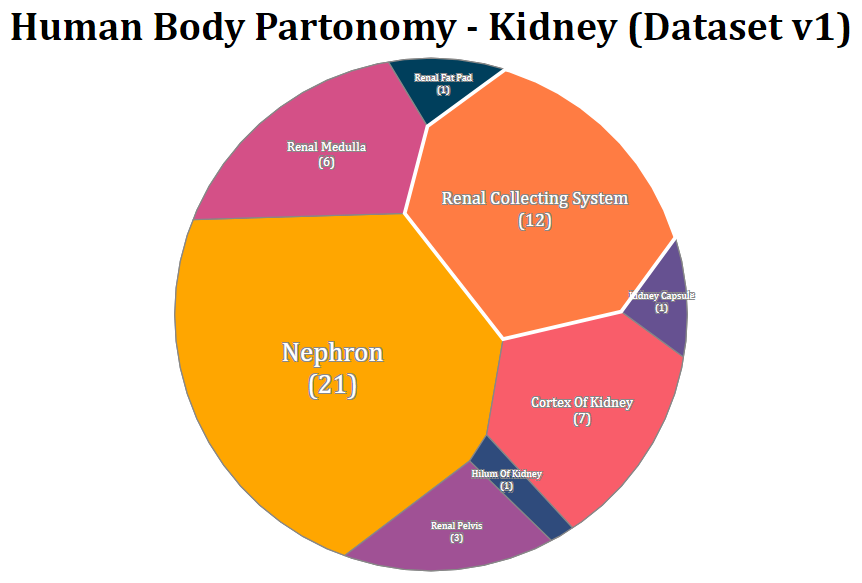
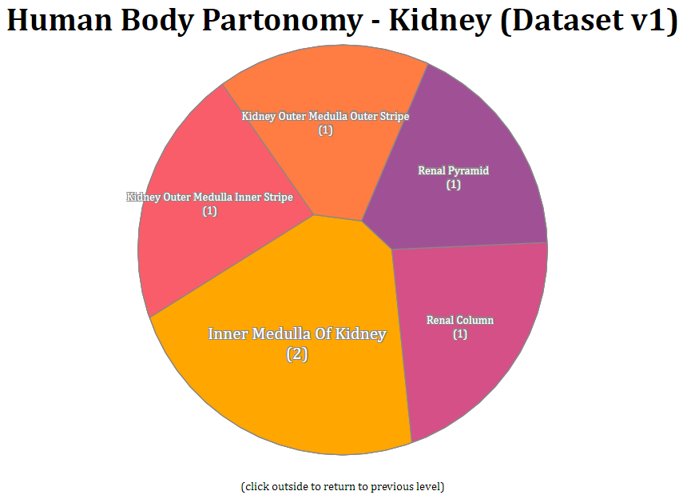

# Human Body Partonomy Visualizer
This is a data visualization tool made for the master tables used by [ASCT+B Reporter](https://hubmapconsortium.github.io/ccf-asct-reporter/). This application is built on Vue.js and D3.js and uses the [voronoi-treemap plugin](https://github.com/Kcnarf/d3-voronoi-treemap) for polygon tessellation and hierarchical data representation. The treemap is designed to be interactive for navigation across levels.




## Details
Initially designed for the Kidney v1 data sheet, the treemap is a unified view Anatomical Structures (AS), Cell Types (CT) and Biomarkers (B), similar to the ASCT+B reporter, and grouped in the same order. The treemap updates itself to show substructures, linked cell types or depicting biomarkers for a selection. The data sheet source can be updated to visualize data for other organs as well.
- The weight of each node is based on the substructures, cell types or biomarkers sharing the same label.
- The tree can be navigated by changing the selected root node and the grouping functions applied. The grouping is done on the labels 'AS/2', 'AS/3', 'AS/4', 'AS/5', 'CT/1', 'BG/1'.
- If no data is available for a label at a particular node, the branch terminates at its parent node (This may result in a node showing higher weight when the sum of its children's weight is lower - the grouping function for a parent would not include the label which has empty data).
## Build and Deployment

### Project setup
```
npm install
```

### Compiles and hot-reloads for development
```
npm run serve
```

### Compiles and minifies for production
```
npm run build
```

### Serve app locally (after building for production)
```
npm install -g serve
serve -s dist
```

### Customize configuration
See [Configuration Reference](https://cli.vuejs.org/config/).
## Acknowledgements
- ASCT+B [master tables](https://docs.google.com/spreadsheets/d/1tK916JyG5ZSXW_cXfsyZnzXfjyoN-8B2GXLbYD6_vF0/edit#gid=2034682742) as the data source.
- [Block](https://bl.ocks.org/Kcnarf/fa95aa7b076f537c00aed614c29bb568) by author of voronoi-treemap plugin for setting up polygon rendering and tessellation wireframe.
